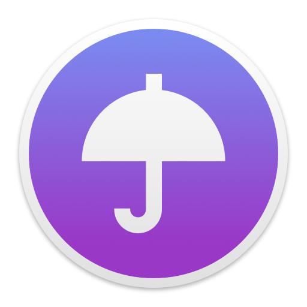

# Electron Starter

This is one of the simplest example with Electron. This app, "Raincast" gets weather info via API, and shows the red icon on the menu bar if it's raining. That's it.

## Quick start

- run `npm install`
- run `npm start` to run app from CLI without building Raincast.app

If you have trouble on `npm install`, try `npm install --save-dev electron-prebuilt` before that.

## Make package

- run `npm run build` to make Raincast.app (in app.zip)
